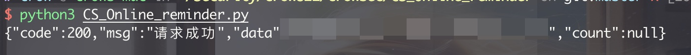
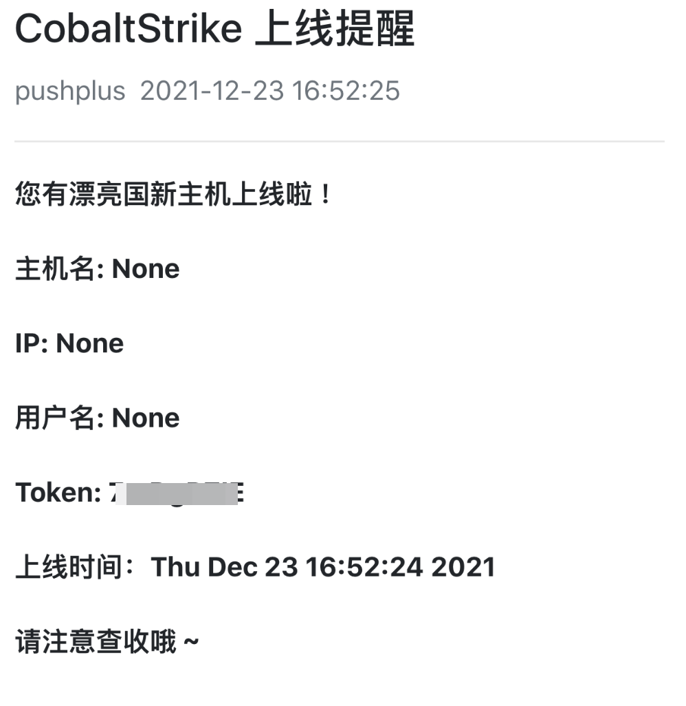
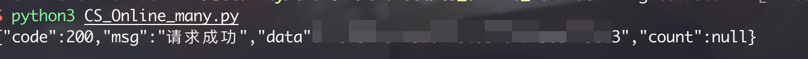
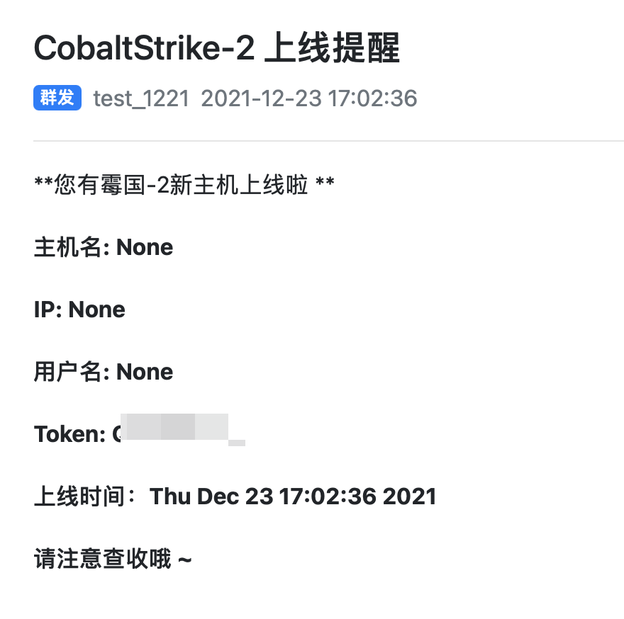
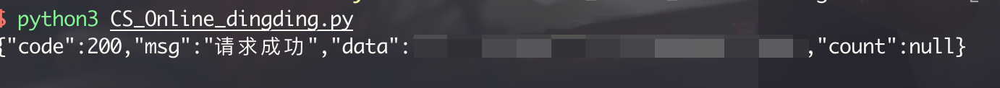
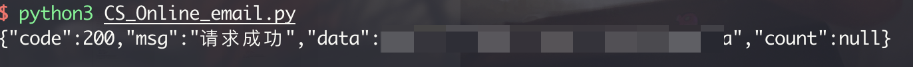
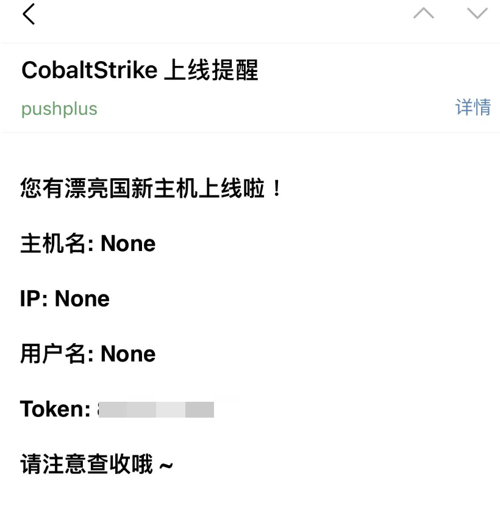
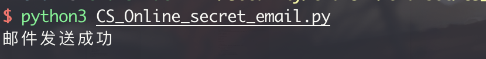
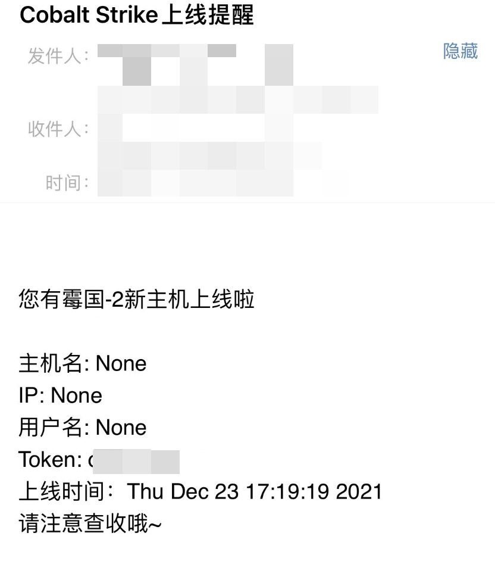

# **多种Cobalt Strike上线提醒方法**

# 参考资料：

https://github.com/lintstar/CS-PushPlus

# 测试方法

## 1. 微信单人提醒

在`http://www.pushplus.plus/push1.html`上扫码登录，会生成一个token。

将你的token写到CS_Online_reminder.py里面去，直接执行python3 ：

`python3 CS_Online_reminder.py`






## 2. 微信群组提醒

新增群组之后配置文件，执行命令：

`python3 CS_Online_many.py`






## 3. 钉钉群上线提醒

在配置完成之后，直接执行命令：

`python3 CS_Online_dingding.py`




## 4. 邮件提醒

在配置完成之后，直接执行命令：

`python3 CS_Online_email.py`





## 5. 隐蔽的邮件提醒

在配置完成之后，直接执行命令：

`python3 CS_Online_secret_email.py`





# Cobalt Strike上线使用方法

在配置完Cobalt Strike之后，可以用命令启动该脚本将其挂载到后台，注意你运行的路径

```
nohup sudo ./agscript Cobalt_Strikeip 端口 用户 密码  CS-PushPlus-main/PushPlus.cna > PushPlus.log 2>&1 &
```


```python
Agscript 用法
这里 agscript 的用法为：
 ./agscript [host] [port] [user] [pass] </path/to/file.cna> 
● [host] # 服务器的 ip 地址。
● [port] # cs 的端口号，启动 cs 时有显示。
● [user] # 后台挂载脚本时连接到 teamserver 的用户名。
● [pass] # 启动服务端 cs 时设置的密码。
● [path] # cna 文件的路径。
```

运行成功之后，可以使用`ps -aux | grep agscript` 查看当前进程：


当有新主机上线时，在微信中会收到提醒：


更多信息请扫描下面公众号获取：

