#                 Mac下安卓模拟器使用Burpsuite抓包方法

### Mac就不配拥有姓名吗？

## 0x01 引言

最初从windows系统换到Macos大概近一年了，首先是用不惯，慢慢习惯之后，开始着手配置Macos下的渗透工具，于是乎发现了诸多个坑，而最近的一个坑便是Mac下安卓抓包的方法。我真的是查了巨久的资料，请教了很多很多的人。。。

## 0x02 坑

我在网上搜到的基本上现在比较好用的安卓模拟器大概两种：雷电模拟器和夜神模拟器，但是因为雷电模拟器不支持Mac系统，所以网上很多人都会推荐夜神模拟器，我遇到的坑便是夜神模拟器，并不是不好用，而是对渗透测试人员来说，想用Burpsuite抓模拟器的包，基本上行不通。。。

网上我查到的资料

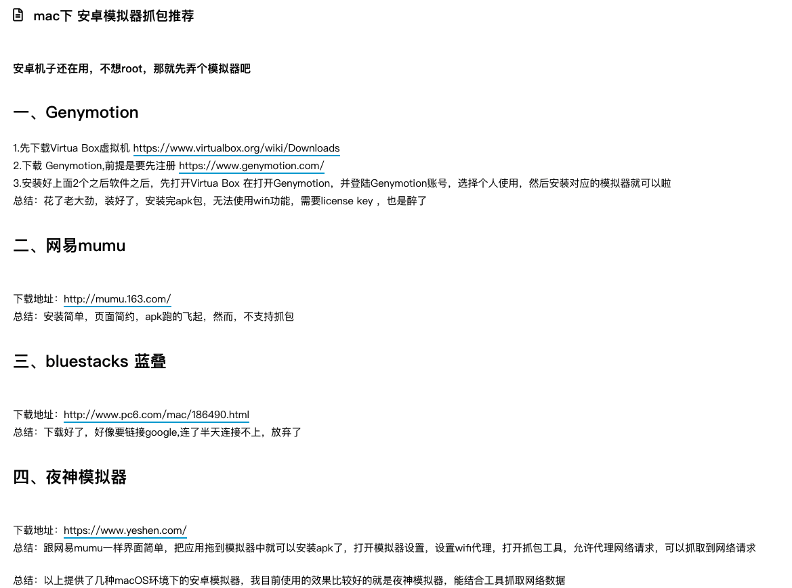


这是作者引用另外一位大佬的文章，自己也说了引用，但是为啥引用的东西该作者修改了。。。（这就是一个巨坑的地方）


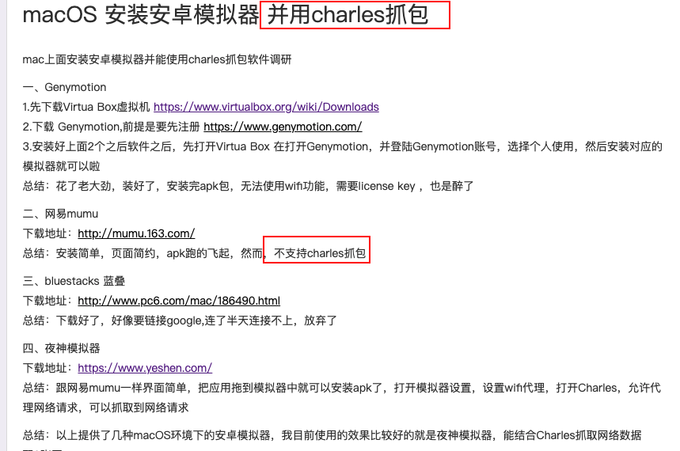


原大佬说的是mumu模拟器不支持charles抓包，但作者搬过来之后就把里面的文字修改掉了，从不支持charles抓包直接变成了不支持抓包。。。。


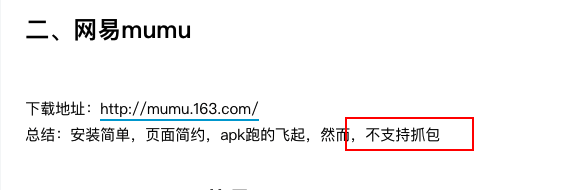

关键就在与作者引用之后还写了一个个人的错误总结（这也是让我深信不疑作者的确抓到包的一个地方）

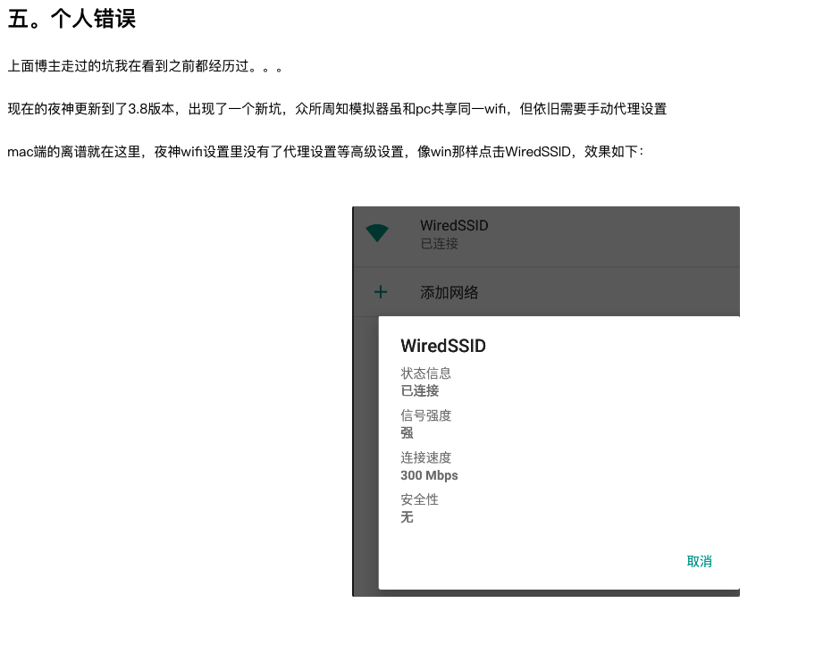


于是，我下载重复安装多次夜神模拟器mac版，重复的去试，从证书位置再到抓包，在这里总结遇到的第一个坑。

## 0x02 第一个坑：AP隔离

当我设置代理之后，bp开启监听模式，但是却抓不到数据。

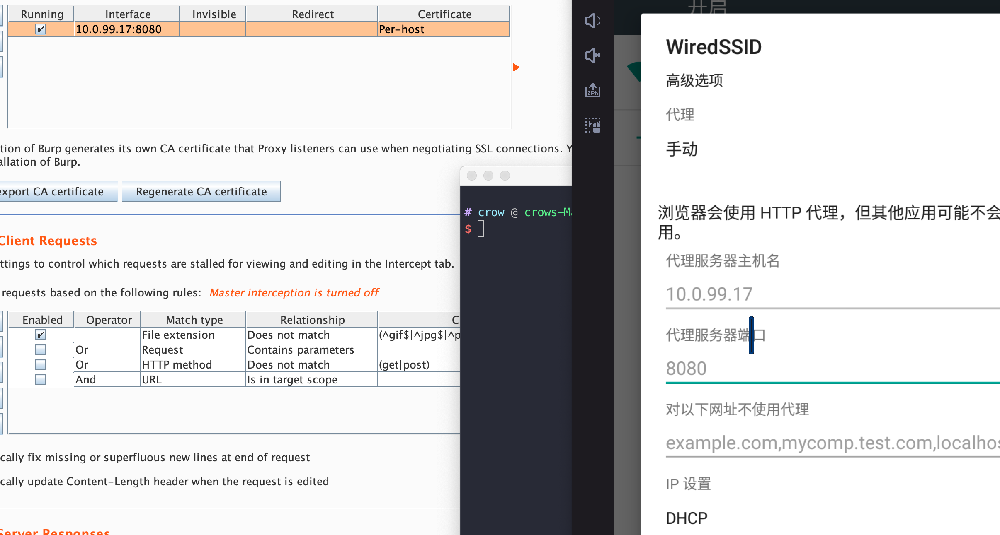

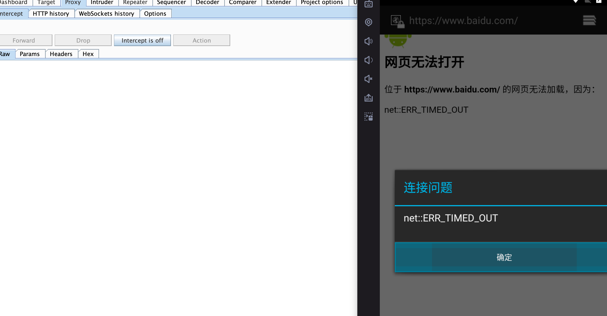

这个问题困扰了我很久，在今天中午吃饭的时候，突然想到以前在家里使用kali进行https攻击测试的时候，无论怎么设置都无法攻击成功，最后我发现是小米路由器的问题。

小米路由器默认设置了AP隔离，主机之间无法ping通。

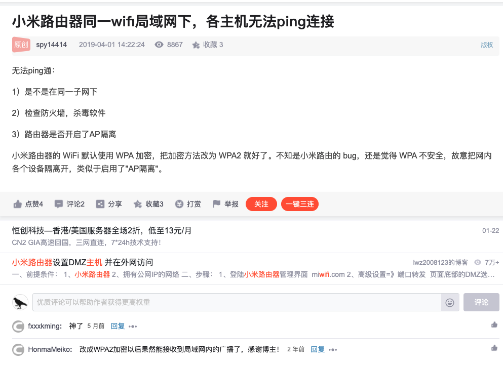

在公司同样遇到了这样的问题，于是使用自己的热点进行测试，终于可以抓到数据了。。。

## 0x02 第二个坑：Mac不配拥有姓名

然而遇到了第二个问题，在浏览器中会一直显示该证书有问题，也有其他的人遇到了这样的问题，当然，这个问题的话，使用Xpose框架和JustTrustMe模块就可以解决。

那就开始安装，然而问题又来了，而且是无法解决

在安装Xpose框架的时候，遇到了显示error 1 occured的问题

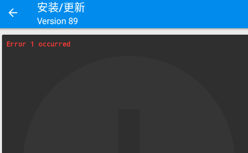

从网上查到的解决方案

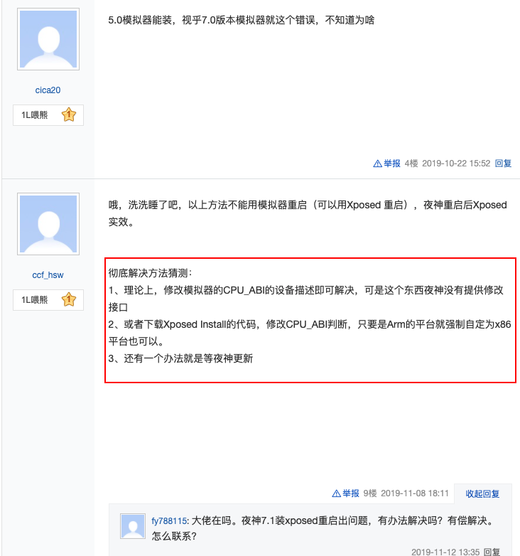


这句话翻译过来就是：Mac目前抓不到夜神模拟器的抓包（主要是因为安卓7.0以上的版本）

真的没有办法解决了嘛？

去Google搜了下，也是没啥好的方法，于是准备从bp转charles抓包，这里就看到大佬的文章，可以用charles抓包

链接：http://www.kailing.pub/article/index/arcid/311.html

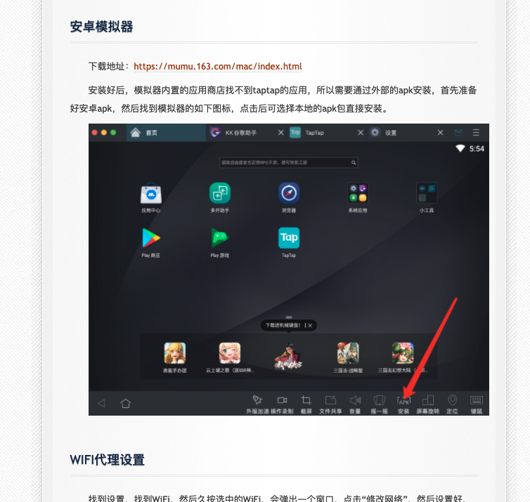

既然他可以用花瓶来抓，那我应该也可以用bp来抓吧？

## 0x03 Mumu模拟器

于是下载了mumu模拟器，而且是最新版

下载之后，开始配置ip地址等，这个过程大家可以看下这个大佬的文章，然后就是下载bp的证书文件，下载之后，在里面是无法修改的，这里有一个好的地方就在于mumu模拟器和mac有一个共享文件夹，可以直接修改文件名，将der文件修改为cer文件即可安装。（安装教程可以百度，都是一样的）

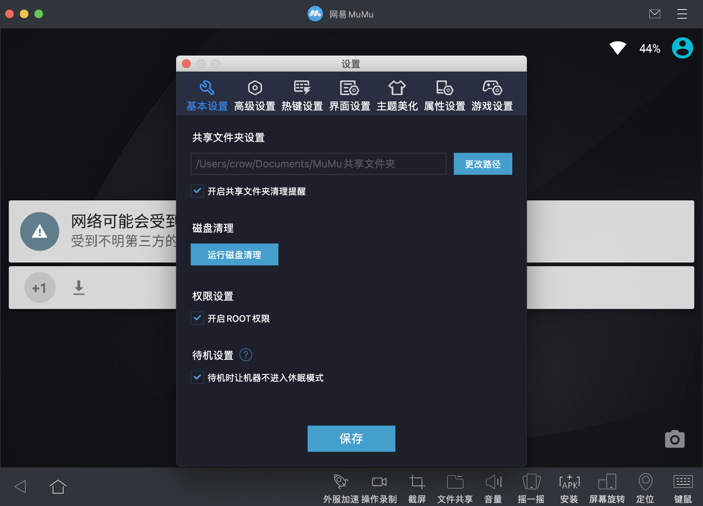

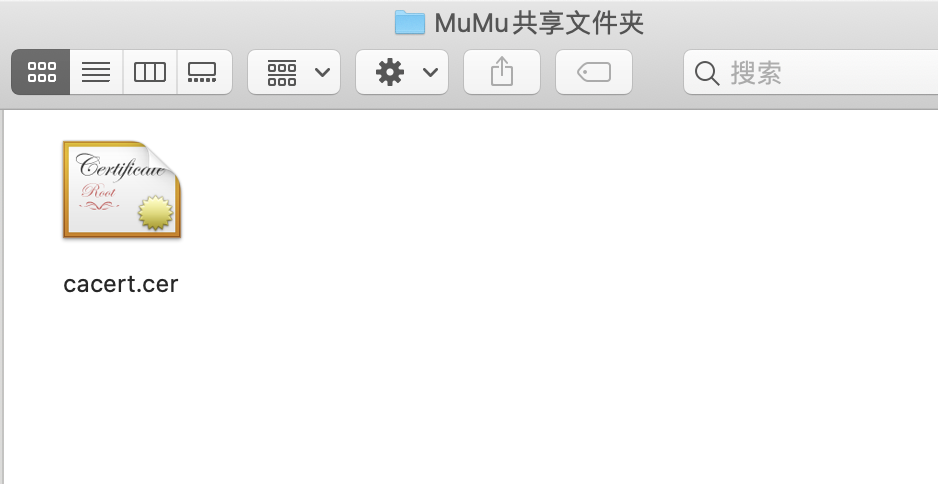

安装bp的证书之后，继续安装以下两个apk（这个百度下教程就有了，安装包在文末）

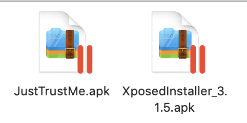

然后进行测试，抓https的包，成功抓到了微博的包，其他的目前正在测试


## 0x04 题外话

而且有些题外话：

1. 在mac上mumu模拟器的速度比夜神模拟器快，快很多很多，毕竟安装模拟器是抓包的，不是玩游戏的
2. 夜神模拟器的锁屏界面解锁简直就是噩梦，我气的快吐血。。。
3. 参考网上的教程还是谨慎点好，也怪自己不仔细。
4. 教程里面Xposed和JustTrustMe的安装可以自行搜索安装，难度不大
5. 本次教程仅限于Macos下的Catalina，大概率不适用Big sur

我的mac版本信息：

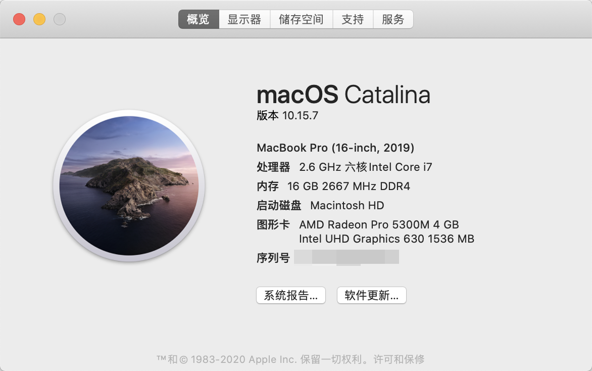


Xposed和JustTrustMe下载地址：

https://github.com/crow821/

也可以在公众号回复关键词：抓包   进行下载

## 0x05  装微信

在安装mumu模拟器之后，如果直接在商店里面下载微信版本的话，会显示安装失败，我试了几种方法发现在网上直接下载微信apk是可以安装的，因此直接在网上下载微信即可，这里我下载的是7.0.13版本，不建议直接下载最新的微信8.0版本，因为后面在抓微信数据包的时候还会遇到困难。。。

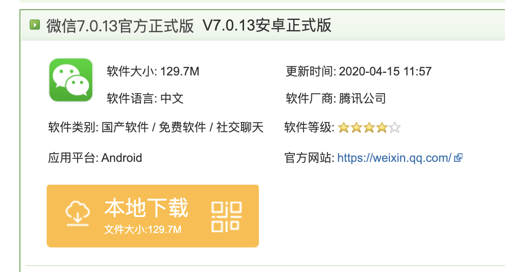

安装之后，就可以直接运行微信了

## 0x06  抓微信小程序数据

打开微信之后，使用bp进行抓包，发现无法抓到微信的任何数据，在这里我查了一下资料，发现有大佬笔记：

```css
安卓系统7.0以下：微信的任意版本，都会信任用户提供的证书
安卓系统7.0以上：微信7.0以下版本，微信会信任用户提供的证书
安卓系统7.0以上：微信7.0以上版本，微信只信任系统及自身内置的证书
参考链接：https://www.jianshu.com/p/dfea1a84bb3b
```

我们搭建的安卓版本是6点多，但是微信是7点多的版本，因此在这里要将在个人账户中的证书进行移动到根证书下，具体的过程还可参考上述文章

```bash
openssl x509 -inform DER -in cacert.der -out cacert.pem  
openssl x509 -inform PEM -subject_hash_old -in cacert.pem |head -1  
mv cacert.pem <hash>.0 
```

执行完成之后就在目录下生成的如下文件：9a5ba575.0

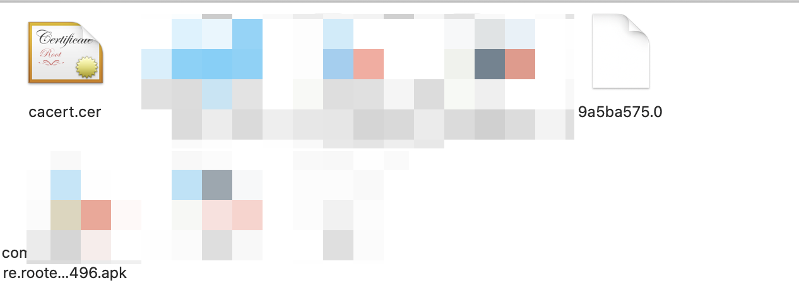

在这里需要将这个文件从用户下移到系统下，在这里可以下载RE文件管理器进行移动。


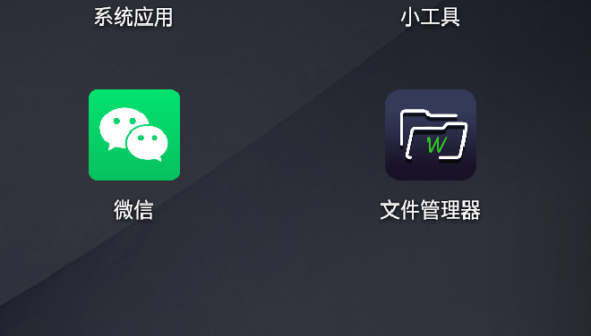

移动完成之后，就算完成了抓微信小程序的所有工作，只需要正常配置BP然后微信登录开始抓包即可！！！

## 0x07 总结

1. Mac下我使用的是Burpsuite进行抓包，也可以用花瓶等其他抓包工具，流程相似
2. 记住，AP隔离是一个比较大的坑，小心为妙
3. 微信的版本是7.x，在这里需要从网上下载之后再去安装
4. Burpsuite生成的根证书需要从用户移到系统中，否则无法抓小程序的数据。
5. 关于微信的xpose框架和JustTrustMe一定要安装

