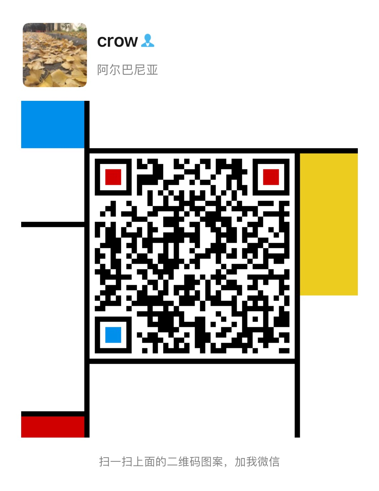

<h1 align="center">crowsec —乌鸦安全</h1>

  
  
  
  
  

# 免责声明

本仓库所提供的技术文章仅供参考，此文所提供的信息只为网络安全人员对自己所负责的网站、服务器等（包括但不限于）进行检测或维护参考，未经授权请勿利用文章中的技术资料对任何计算机系统进行入侵操作。利用此文所提供的信息而造成的直接或间接后果和损失，均由使用者本人负责。

乌鸦安全拥有对此仓库的修改、删除和解释权限，如转载或传播此文章，需保证仓库的完整性，未经授权，不得用于其他。

本仓库所提供的工具仅用于学习，禁止用于其他，请在24小时内删除工具文件！！！

# 初衷

这些课件分享的目的是为了方便大家学习，请大家一定要记住不要做违法的事情。

1. 课件中可能存在一些错误，也有可能是我没有来得及修改的，如果有问题的话，大家可以在我的微信公众号：乌鸦安全  里面留言，我看到之后都会回复的。

2. 视频中可能有错误的地方，或者是讲的不对亦或许不详细的地方，怎么讲呢？反正我感觉大家能够学会就可以了，我自己也是抽时间录制的，所以ppt准备的也不是很好，因为我自己有时候很忙（懒），所以请勿见怪！

3. 后面我只要是有时间的话，会录制更多的视频教程，简单的到复杂的都会录制的，基础是最重要的！！！

4. 大家感觉需要讲的地方也可以和我说，我可能会特别关注的。

   ​                                                                                                                                                          **by: crow**
   
   # 你可以在这里找到我
   
   ### GitHub：https://github.com/crow821
   
   ## B站：https://space.bilibili.com/29903122
   
   ## 公众号：
   
   
   
   ### Wechat：      
   

# stars

 

# License

Copyright © 2022 [crow821](https://github.com/crow821)

本项目遵循协议：[GPL--3.0 License](https://github.com/crow821/crowsec/blob/master/LICENSE)

