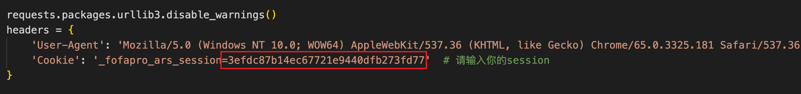
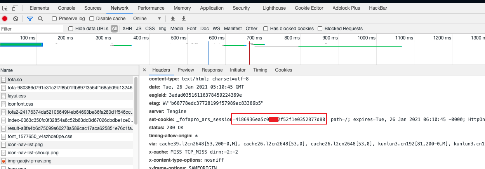
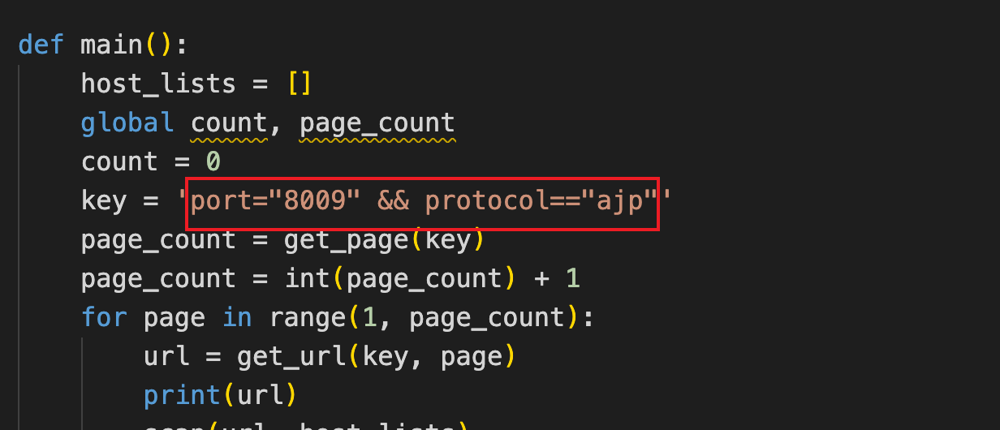
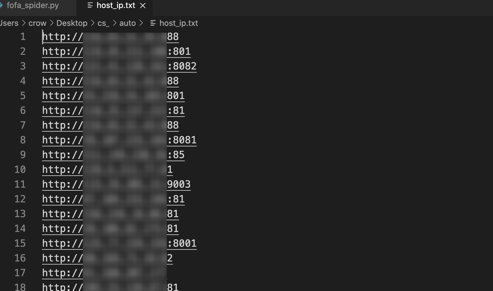

### 										一款好用的fofa信息搜集脚本

在去年hw的时候需要用到信息搜集，但是自己又很懒，于是在github上找到了一个大佬写好的脚本，自己在大佬的基础上修改了下，这这里和大家分享下

​                                                             **因为时间比较久了，这个大佬的GitHub我没找到，特此申明下**

##### 这个也需要你有一个fofa的会员账号，毕竟fofa对于会员来说，没有提供像shodan一样的api接口，因此这里使用脚本爬取数据

#### 环境：python3 

如果运行脚本的时候提示缺少包，可以直接通过pip install xxx或pip3 install xxx安装即可！

#### 设置

- 在此输入你fofa的session

fofa获取session的方法

- 输入你的关键词填入key中

注意：这里需要你输入key两边是有两个单引号的

#### 运行效果

在运行完成之后，会在本地生成一个txt文件

